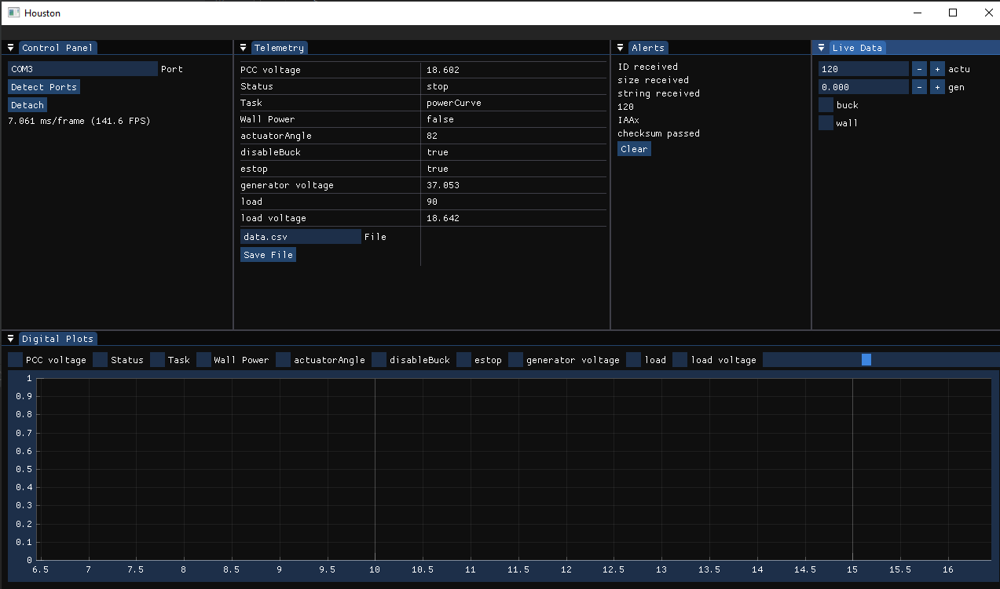

# Houston
Houston is a C++ based dashboard for monitoring microcontrollers during operation. I built it to monitor my university's
wind turbine, but it can be used for any board that supports serial data.


## ToDo (not necessarily in order)

* Better Multithreading
* ~~Live Graphs~~
* ~~Save Data to File~~
* Max,min,etc for variables
* ~~Live Variables~~
* Installation Guide
## Work in progress Documentation
### Protocol Specifications

### Modify Packet

This is used to modify a value within the system

* [Format](https://docs.python.org/3/library/struct.html): <BH3s[f/I]I
    * B: packet id, used to specify type of action
    * H: Number of bytes contained in string data. For modify packet:3
    * [#]s: First byte will specify numeric data's type. F for float, I for integer,B for boolean. The next 2 byte will
      be the variable name to change
    * [f/I]: The actual numeric data specified by previous, boolean still uses I
    * I: checksum of 3s[f/I] data
### Linux
```cmake -B . -S . -DCMAKE_TOOLCHAIN_FILE=[vckpg path]```
``` cmake --build . -- -j 4```